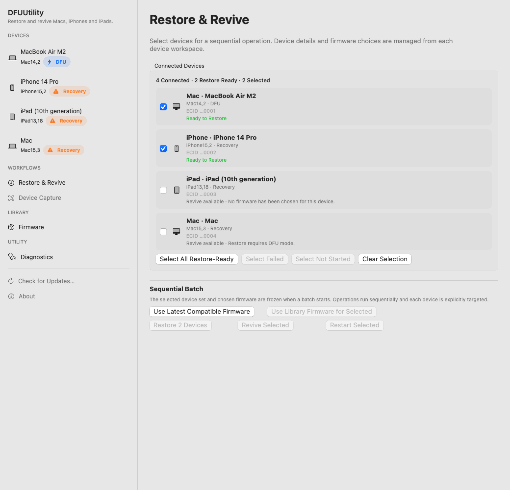
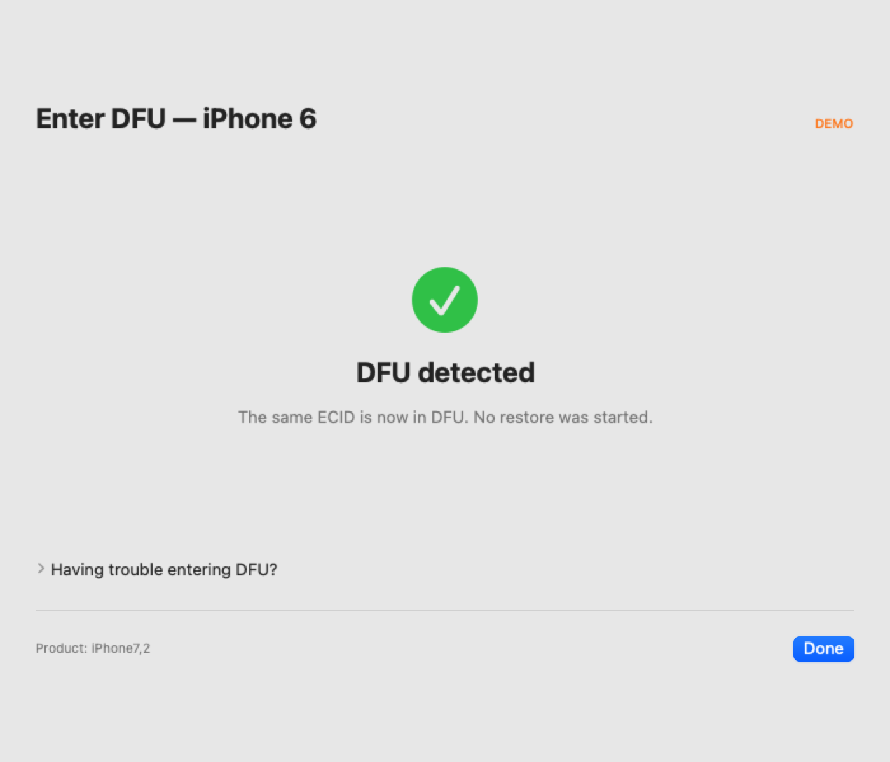
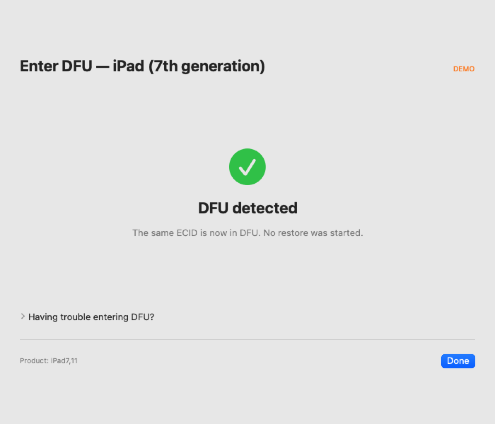
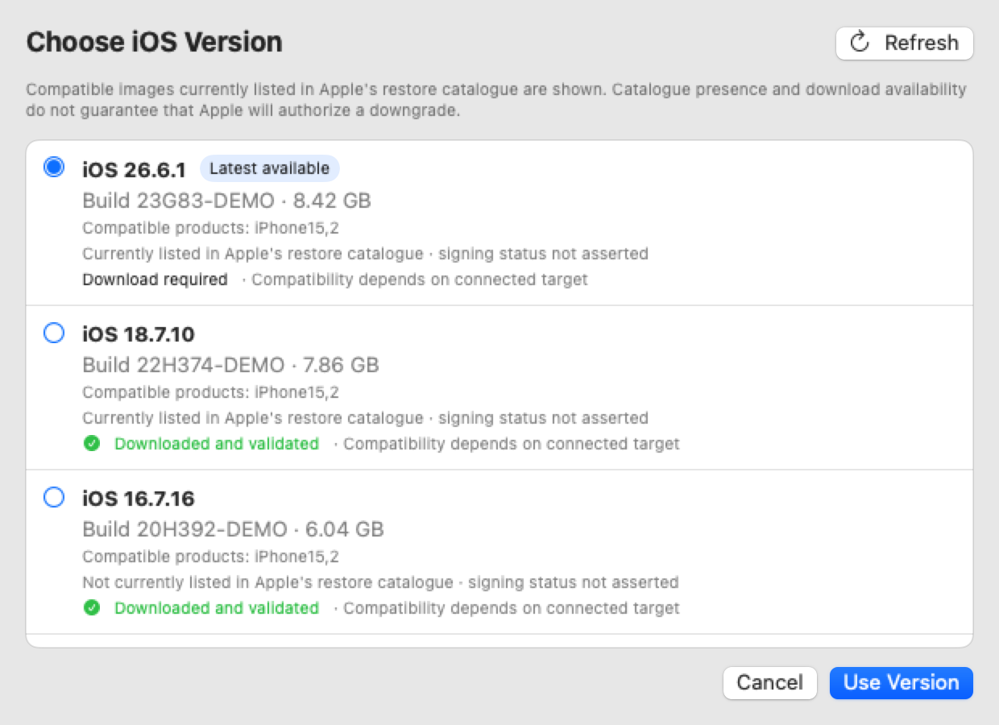
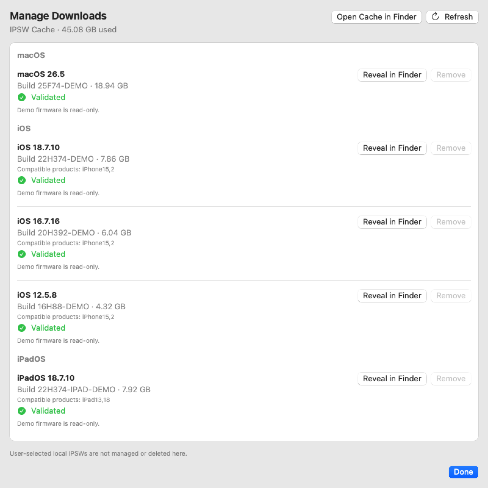
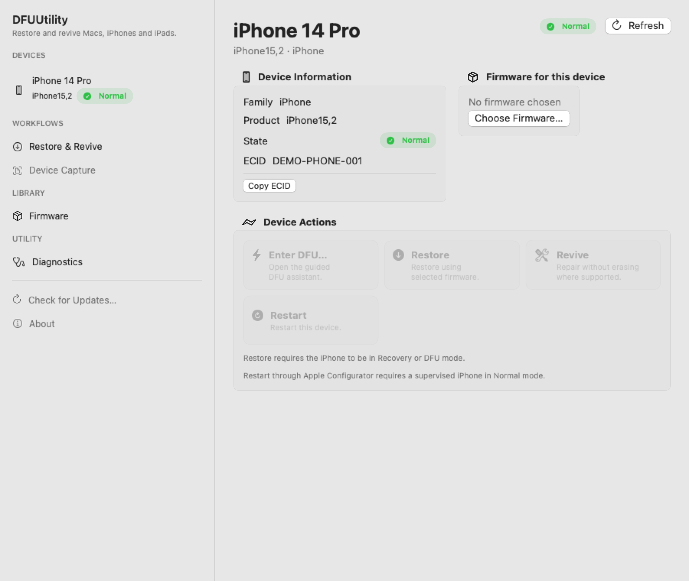
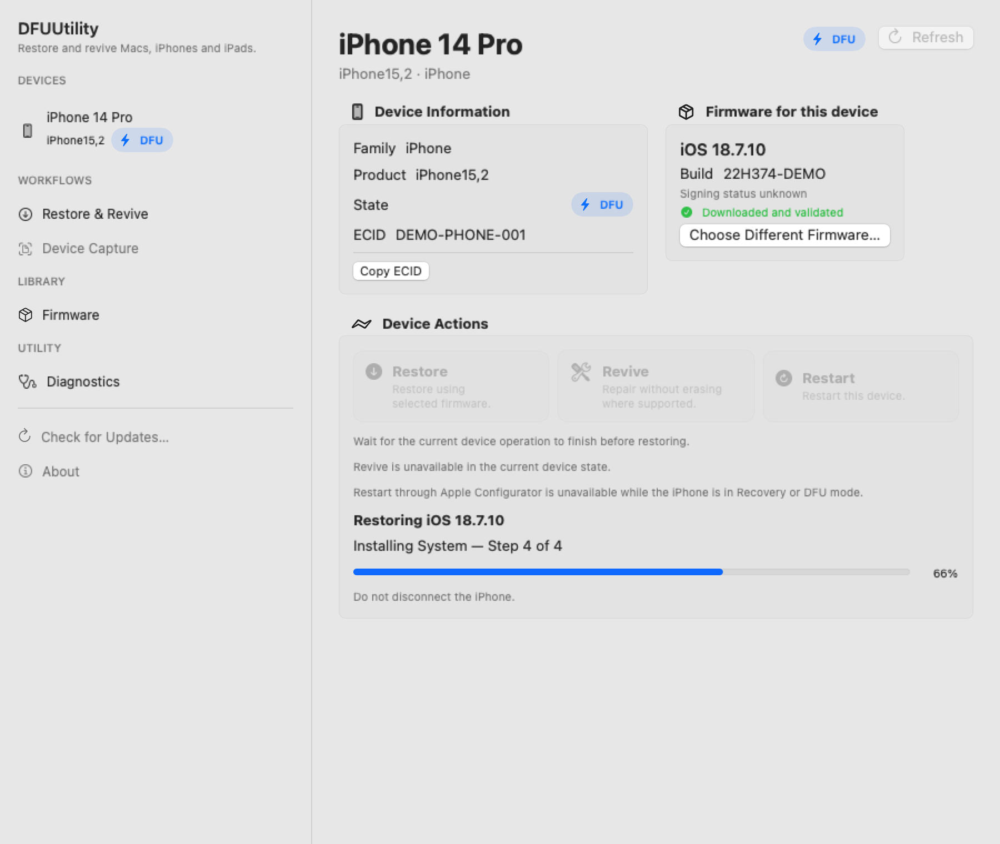
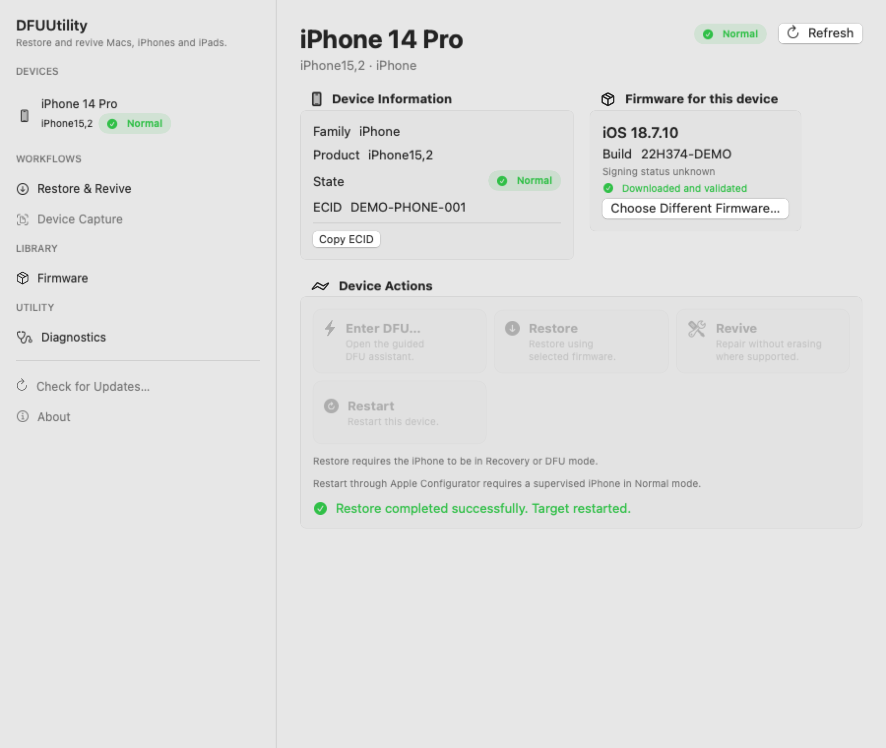

# DFUUtility

DFUUtility is an open-source native macOS utility for entering supported Macs into DFU mode and restoring or reviving Apple devices with Apple IPSWs.



Version 0.6.1 is a focused patch release improving post-operation state recovery, Mac Enter DFU error handling, and Community installation. Community builds are local and ad-hoc signed; no paid Apple Developer account is required.

## Features

### Mac

- Detect Normal, Recovery, and DFU targets and preserve the target ECID across transitions.
- Enter DFU using the bundled `macvdmtool` and standard macOS administrator authorization.
- Restore or Revive through Apple Configurator with real stage-local progress and operation logs.

### iPhone and iPad

- Discover mobile targets and retain product type and ECID metadata.
- Guide supported physical-button DFU sequences without sending device commands.
- Require same-ECID DFU enumeration before reporting success.
- Restore compatible validated IPSWs with destructive confirmation and live progress.

### Firmware management

- Discover compatible Apple macOS, iOS, and iPadOS restore images.
- Resume downloads, validate integrity and archive structure, and reuse a platform-separated cache.
- Inspect storage, reveal files, resume partials, and confirm removal in **Manage Downloads…**.
- Select a local IPSW without placing it under DFUUtility's cache management.

### Safety

- Explicit target selection when multiple devices are attached.
- Product compatibility and IPSW validation gates before Restore.
- Separate native destructive confirmation; Restore never begins from DFU detection alone.
- Demo and screenshot modes cannot invoke hardware operations.

### Multiple devices

- Multiple connected devices are represented as independent sessions keyed by ECID where available, with UDID/serial used only to preserve non-destructive presentation state when ECID is unavailable.
- A device without ECID, UDID, or serial receives a new ephemeral session on rediscovery so another physical device cannot inherit its firmware or operation state; it remains unavailable for batch execution until an ECID is present.
- Batch Restore, Revive, and Restart freeze an explicit checkbox selection and run sequentially; every cfgutil command remains targeted to one ECID.
- Firmware selection, validation, progress, reconnect verification, results, and logs remain per device. A failure is recorded and the next queued device continues; **Stop After Current Device** prevents new operations from starting without interrupting the active restore.
- Automatic Mac Enter DFU remains single-target because upstream `macvdmtool dfu` does not provide an unambiguous target selector.

Batch execution is intentionally sequential in this first implementation. Parallel destructive operations are not supported.

## Screenshots

| Guided iPhone DFU | Guided iPad DFU |
| --- | --- |
|  |  |

| Firmware chooser | Manage Downloads |
| --- | --- |
|  |  |

| Download progress | Restore progress |
| --- | --- |
|  |  |

| Completed Restore |
| --- |
|  |

All screenshots use deterministic fictional data; they contain no real device or user identifiers.

## Installation

Requirements: macOS 14 or newer, [Apple Configurator](https://apps.apple.com/app/apple-configurator/id1037126344), a data-capable cable, and internet access for automatic firmware downloads. The current Mac DFU workflow requires an Apple Silicon host. Administrator authorization is requested only when entering a Mac into DFU.

```sh
git clone https://github.com/thehallifax/DFUUtility.git
cd DFUUtility
scripts/install-local.sh
```

Open `/Applications/DFUUtility.app`. To uninstall the local build, run `scripts/uninstall-local.sh`.

The normal installer builds, packages, verifies, and installs the app with concise progress output. It does not run the repository test suite, so full Xcode is not required merely to install DFUUtility when the selected Command Line Tools can compile the release app. Contributors with a newer Swift/Xcode toolchain that includes Swift Testing can validate before installation explicitly:

```sh
scripts/install-local.sh --test
```

For complete build, packaging, and verification output, use verbose mode. The flags can be combined in either order:

```sh
scripts/install-local.sh --verbose
scripts/install-local.sh --test --verbose
```

### Updating

DFUUtility normally performs a lightweight daily check for newer Community source after launch. It never installs automatically. Choose **DFUUtility → Check for Updates…** to perform a fresh check; **Update Now** quits the running app, safely fast-forwards its original Git clone, rebuilds and verifies the app locally, installs it, and relaunches it. The original checkout must still exist, remain on `main`, and have no local changes.

The installer records the canonical source location in the user's DFUUtility application-support folder; no developer path is embedded in the app. Update progress and failures are recorded in `~/Library/Logs/DFUUtility/update.log`. A failed build or verification leaves the existing installed app available.

Manual updating remains available as a fallback:

```sh
cd /path/to/DFUUtility
scripts/update.sh
```

The updater checks GitHub for newer source, refuses to overwrite local changes, and fast-forwards the `main` branch without creating a merge commit. When an update is available, it reuses the existing installer to build, verify, and replace `/Applications/DFUUtility.app`; the installer moves the previous application to Trash.

```sh
scripts/update.sh --check    # Check without pulling, building, or installing
scripts/update.sh --verbose  # Show complete installer output
scripts/update.sh --test     # Run the repository tests before installation
```

The flags may be combined. In-app and shell updates are intended for clean end-user clones. Contributors with local changes or feature branches should manage their Git checkout manually; the updater never stashes, resets, cleans, switches branches, or discards work.

## Usage

1. Connect the target with a data-capable cable and select it if more than one device is attached.
2. Choose compatible Apple firmware with **Change Version…**, or use **Choose Local IPSW…**.
3. Download and validate the image if needed.
4. Enter DFU: Mac entry is initiated by the app; supported iPhone/iPad entry follows the guided physical-button assistant.
5. Choose Revive where supported, or confirm Restore.

> **Restore erases the target device.** Back up recoverable data first. Restore does not bypass Activation Lock, ownership, enrollment, or setup requirements. Revive is not a backup and offers no data-preservation guarantee.

## Tested hardware

| Device | Product | Detection | Guided DFU | Restore/Revive |
| --- | --- | --- | --- | --- |
| MacBook Air M2 | `Mac14,2` | Normal/DFU: PASS | GUI same-ECID DFU: PASS | Restore and Revive: PASS |
| iPhone 6 | `iPhone7,2` | Normal/Recovery/DFU: PASS | Same-ECID DFU: PASS | End-to-end Restore: PASS |
| iPad (7th generation) Wi-Fi | `iPad7,11` | Normal/DFU: PASS; Recovery: pending | Same-ECID DFU: PASS | Destructive Restore: not tested |

For `iPad7,11`, compatible iPadOS discovery, GUI download, and IPSW validation also passed on real hardware. The authoritative, deliberately scoped record is [Config/HardwareAcceptance.json](Config/HardwareAcceptance.json).

## Older Lightning troubleshooting

If an older Lightning device repeatedly lands in Recovery with direct USB-C to Lightning, try USB-A to Lightning through a USB-C adapter or hub. This helped the tested iPhone 6; it is troubleshooting guidance, not a universal requirement. Testing has not established that USB-A is required for the iPad.

## Firmware cache

Managed downloads live under `~/Library/Caches/DFUUtility/IPSW/`, separated by platform. **Manage Downloads…** shows total storage, validation state and failure detail, and offers Reveal, Resume, and confirmed Remove actions. Operation logs live under `~/Library/Logs/DFUUtility/` and are available through **View Log**.

## CLI

```sh
swift build -c release
.build/release/dfuctl doctor
.build/release/dfuctl status
.build/release/dfuctl ipsw list
.build/release/dfuctl ipsw cache
```

Explicit hardware commands are `.build/release/dfuctl dfu`, `.build/release/dfuctl revive`, and `.build/release/dfuctl restore /path/to/Restore.ipsw`. Restore is destructive. The CLI's safe privilege behavior is documented in [Privileged helper architecture](docs/PRIVILEGED_HELPER.md).

## Build from source

```sh
swift build
swift test
swift build -c release
scripts/package-app.sh release
scripts/verify-app.sh .build/app/DFUUtility.app
```

Run `swift run DFUUtility --demo` for a hardware-inert demo. `scripts/release-check.sh` performs builds, tests, read-only CLI smoke checks, packaging, metadata, license, signature, acceptance, screenshot, and ZIP checks; it never enters DFU, restores, revives, authorizes, or downloads firmware.

## Security and privilege model

Community builds invoke only the bundled `macvdmtool dfu` operation through macOS's standard administrator UI. DFUUtility never reads or stores a password and does not use interactive `sudo`, setuid, or a custom password dialog. A future Developer ID distribution can use the embedded `SMAppService` privileged helper with matching Team-ID signatures, hardened runtime, and notarization. See [Signing and distribution](docs/SIGNING_AND_DISTRIBUTION.md).

Apple Configurator's `cfgutil` remains required for device discovery, Restore, and Revive. Mobile DFU requires physical button input and is hardware validated only for the products listed above.

## Contributing

See [CONTRIBUTING.md](CONTRIBUTING.md) for focused development and privacy-safe issue reporting. See the [0.6.1 release notes](docs/RELEASE_NOTES_0.6.1.md) for this patch and the [0.6.0 release notes](docs/RELEASE_NOTES_0.6.0.md) for the underlying feature release.

## License

DFUUtility is licensed under the [Apache License 2.0](LICENSE).

## Third-party software

DFUUtility bundles upstream [Asahi Linux macvdmtool](https://github.com/AsahiLinux/macvdmtool) at commit `b22ae51eb43a0e1daa21d41616ac899f28e7bf8a`. macvdmtool remains Copyright 2021 The Asahi Linux Contributors and Apache-2.0 licensed; DFUUtility does not claim ownership or relicense it. Its upstream source, attribution, [license](Vendor/macvdmtool/LICENSE), and [revision record](Vendor/macvdmtool/UPSTREAM_REVISION) are preserved and included in packaged apps.
