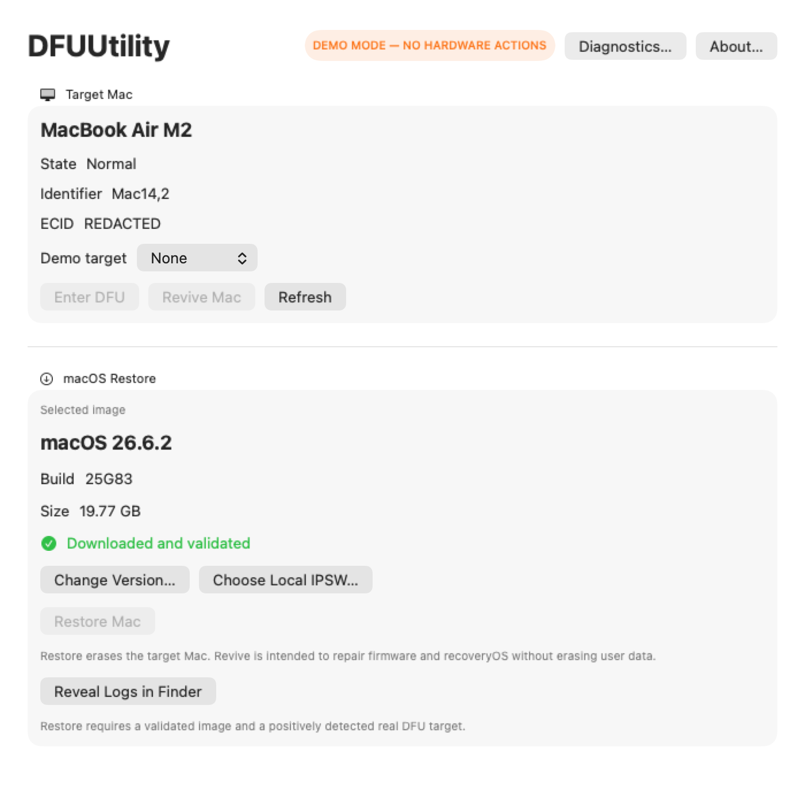
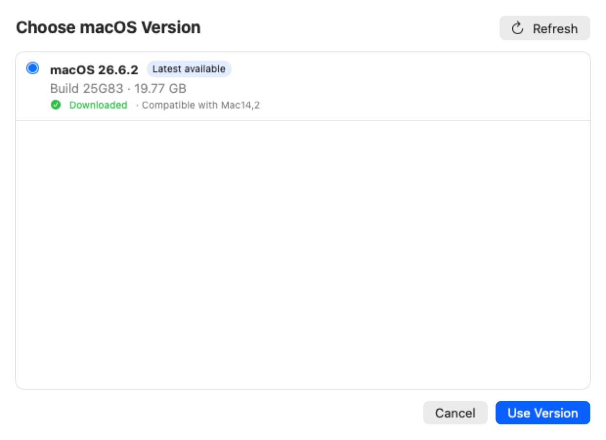
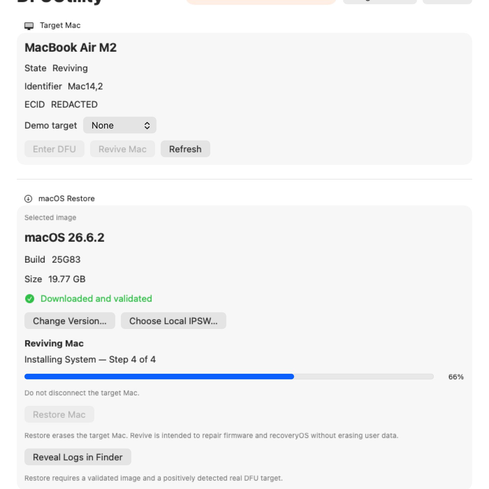
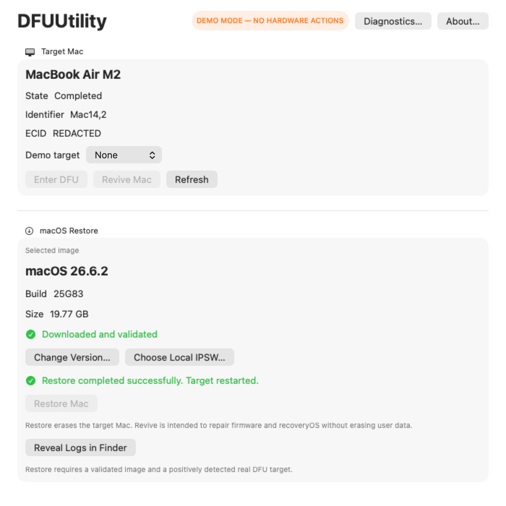

# DFUUtility

DFUUtility is a free, open-source native macOS utility for placing a supported Mac in DFU mode, then reviving or restoring it with Apple Configurator. It combines target detection, Apple IPSW discovery and caching, safety checks, and live `cfgutil` progress in one SwiftUI app.

> **Community beta:** Version 0.5.0 has been hardware-tested on a MacBook Air M2 (Mac14,2). Broader Apple Silicon and Intel T2 coverage is pending. Community builds are built locally and ad-hoc signed; there is no notarized binary release yet.

## Features

- Detects a single connected target in Normal, Recovery, or DFU state.
- Enters DFU with macOS-provided administrator authorization and verifies the same ECID after transition.
- Discovers compatible restore images directly from Apple, downloads with resume support, validates them, and reuses a managed cache.
- Provides a native macOS version chooser and local IPSW fallback.
- Revives or restores through Apple Configurator's `cfgutil`, with real stage-local progress and operation logs.
- Bundles the pinned `macvdmtool` dependency; users do not install it separately.
- Includes a safe demo mode that cannot invoke hardware tools.

## Screenshots

| Normal target | DFU target |
| --- | --- |
|  |  |

| Version chooser | Live progress | Completed operation |
| --- | --- | --- |
|  |  |  |

Screenshots use deterministic demo data and contain no real ECIDs, usernames, or private paths.

## Requirements

- macOS 14 or newer on the host Mac.
- An Apple Silicon host for the currently supported **Enter DFU** workflow.
- [Apple Configurator](https://apps.apple.com/app/apple-configurator/id1037126344), which supplies `cfgutil` for discovery, revive, and restore.
- A USB-C data cable and the correct DFU port/procedure for the target Mac.
- Internet access for automatic IPSW discovery and download.
- Administrator authorization when **Enter DFU** is clicked; DFUUtility never reads or stores the password.

No Apple Developer Program membership is required for a Community build.

## Install

Clone or download the repository, then use the local installer from its root:

```sh
git clone https://github.com/thehallifax/DFUUtility.git
cd DFUUtility
scripts/install-local.sh
```

Open `/Applications/DFUUtility.app`. Use `scripts/install-local.sh --skip-tests` only when the tests have already passed.

To remove the locally installed app:

```sh
scripts/uninstall-local.sh
```

## Usage

1. Connect exactly one target Mac with a USB-C data cable.
2. If it is in Normal state, click **Enter DFU** and approve the standard macOS authorization prompt.
3. Choose an Apple restore image with **Change Version…**, or select a local IPSW.
4. Download and validate the image if necessary.
5. Choose **Revive Mac** or **Restore Mac**.

Images downloaded from Apple's CDN are stored under `~/Library/Caches/DFUUtility/IPSW/`. Operation logs are stored under `~/Library/Logs/DFUUtility/` and remain available through **View Log**.

## Community vs Signed Builds

The Community path builds locally, uses an ad-hoc signature, and asks macOS to run only the bundled `macvdmtool dfu` command with administrator privileges through the system authorization UI. It does not use Terminal, interactive `sudo`, `sudo -S`, a custom password field, setuid, or a background helper.

A future Developer ID distribution uses the embedded `SMAppService` privileged helper. That architecture requires matching Team-ID signatures, hardened runtime, notarization, and clean-machine acceptance. See [Signing and distribution](docs/SIGNING_AND_DISTRIBUTION.md) and [Privileged helper architecture](docs/PRIVILEGED_HELPER.md).

## Hardware Tested

Community GUI acceptance on **MacBook Air M2 (Mac14,2)** with DFUUtility 0.5.0:

- Normal target detection: PASS
- GUI Enter DFU and same-ECID verification: PASS
- GUI Revive: PASS
- GUI Restore: PASS
- Live `cfgutil` progress: PASS
- Target restart verification: PASS

The machine-readable record is [Config/HardwareAcceptance.json](Config/HardwareAcceptance.json). This result does not imply coverage of every Apple Silicon or Intel T2 model.

## Safety

> **Restore erases the target Mac.** It requires a validated image, exactly one positively detected real DFU target, and a separate native destructive confirmation.

Revive is intended to repair firmware and recoveryOS without erasing user data, but it is not a backup and no data-preservation guarantee is made. Downloads, image validation, navigation, and demo mode cannot start a device operation.

## CLI

Build and inspect the host:

```sh
swift build
swift test
swift build -c release
.build/release/dfuctl doctor
.build/release/dfuctl status
```

IPSW management:

```sh
.build/release/dfuctl ipsw list
.build/release/dfuctl ipsw latest
.build/release/dfuctl ipsw cache
.build/release/dfuctl ipsw download latest
.build/release/dfuctl ipsw clean --partials
```

Explicit device operations:

```sh
sudo .build/release/dfuctl dfu
.build/release/dfuctl revive
.build/release/dfuctl restore /path/to/UniversalMac_Restore.ipsw
```

Restore is destructive and never runs unless explicitly invoked. Helper lookup precedence is the app-bundled copy, `DFUCTL_MACVDMTOOL_PATH`, the SwiftPM-built sibling, `/opt/homebrew/bin`, then `/usr/local/bin`.

## Development

Run the SwiftUI app directly:

```sh
swift run DFUUtility
```

Run deterministic demo mode without hardware access:

```sh
swift run DFUUtility --demo
```

Package and verify the Community app:

```sh
scripts/package-app.sh release
scripts/verify-app.sh .build/app/DFUUtility.app
scripts/release-check.sh
```

`release-check.sh` builds and tests, runs only read-only CLI commands, packages and verifies the app, checks metadata and licensing, and prints the ZIP SHA-256. It never enters DFU, revives, restores, downloads an IPSW, changes helper registration, or requests authorization. `--strict` additionally requires a clean worktree.

See [CONTRIBUTING.md](CONTRIBUTING.md) for contribution and reporting guidance. Release details are in [0.5.0 release notes](docs/RELEASE_NOTES_0.5.0.md).

## Known Limitations

- Hardware validation is limited to MacBook Air M2 (Mac14,2); broader Apple Silicon and Intel T2 testing remains pending.
- Community builds are local, ad-hoc builds. No notarized binary is distributed.
- Apple Configurator and its `cfgutil` executable remain required.
- Only a single connected target is supported.
- Apple MobileAsset catalogue data is an operational interface rather than a versioned public SDK. `cfgutil` makes the final compatibility and personalization determination.
- Progress is real and stage-local; DFUUtility does not fabricate an overall percentage. Active operation cancellation is not offered until it is hardware-tested safely.

## License

DFUUtility is licensed under the [Apache License 2.0](LICENSE). The public repository is [thehallifax/DFUUtility](https://github.com/thehallifax/DFUUtility).

This project license does not transfer ownership of or relicense bundled third-party software. Third-party components retain their upstream copyright, attribution, and license notices.

## Third-party licenses

DFUUtility bundles the upstream [Asahi Linux macvdmtool](https://github.com/AsahiLinux/macvdmtool) project at commit `b22ae51eb43a0e1daa21d41616ac899f28e7bf8a`. It is Copyright 2021 The Asahi Linux Contributors, incorporates credited work from ThunderboltPatcher, and is licensed under Apache License 2.0. DFUUtility does not claim ownership of this upstream code. Its unchanged source, README, full [license](Vendor/macvdmtool/LICENSE), and [pinned revision record](Vendor/macvdmtool/UPSTREAM_REVISION) are retained. Packaged apps include these materials under `Contents/Resources/ThirdPartyLicenses/`.
